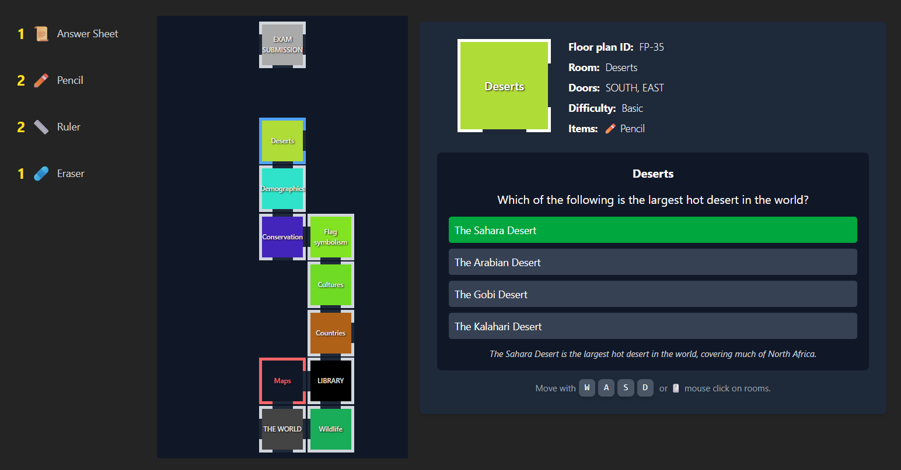

# Exam Prince

Exam Prince is a quiz adventure game built with React and Vite.
Instead of answering questions on a static form, you walk through a house, open rooms, choose floor plans, and solve topic-based questions to complete an exam run.

## Screenshot



## Game Concept

You start by selecting a topic from the built-in JSON question banks.
Inside the house, each room represents a question challenge:

- Open rooms and reveal questions.
- Select the correct floor plan and answer to progress.
- Wrong answers lock the room as failed.
- Find the single answer sheet item and submit it at the exam submission area.
- Receive a final certificate with score and letter grade.

The final score is based on discovered rooms, correct answers, and failed rooms.

## Controls

- `W`, `A`, `S`, `D`: movement/navigation actions.
- `E`: context action (continue/select/submit in supported screens).
- `Q`: available in the keyboard input system for context-specific interactions.

## Core Flow

1. Pick a topic on the topic selection screen.
2. Enter the house exam session.
3. Explore, open rooms, and answer questions.
4. Collect required item(s), especially the answer sheet.
5. Submit your exam.
6. View result summary with score and grade.

## Tech Stack

- React
- Vite
- Tailwind-style utility classes for UI styling

## Local Development

Install dependencies and start the dev server:

```bash
npm install
npm run dev
```

Build for production:

```bash
npm run build
```
